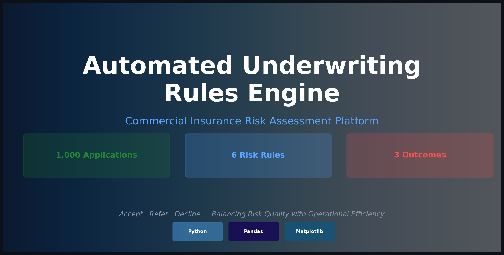
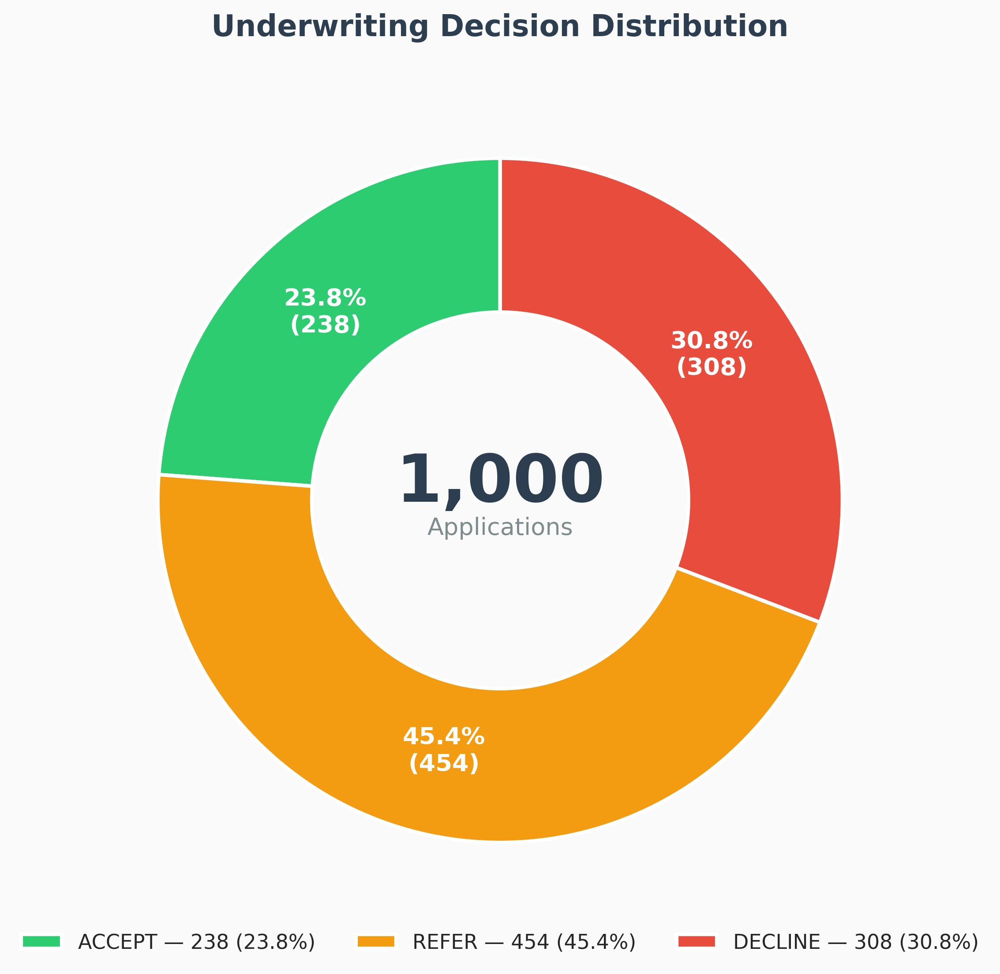
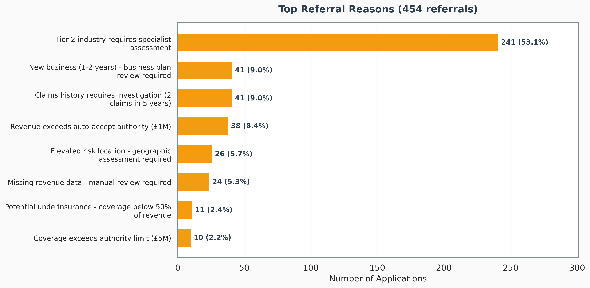
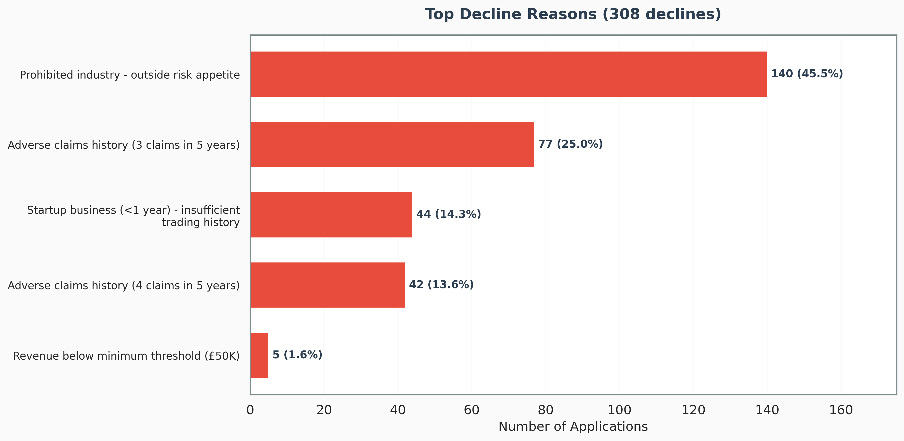
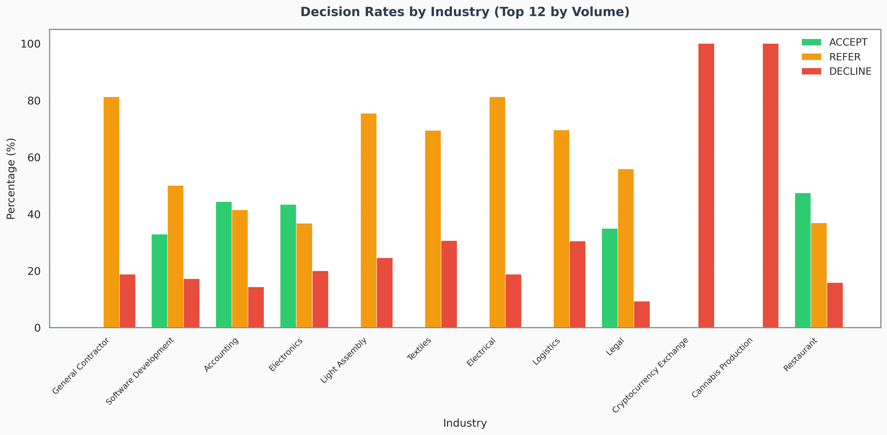
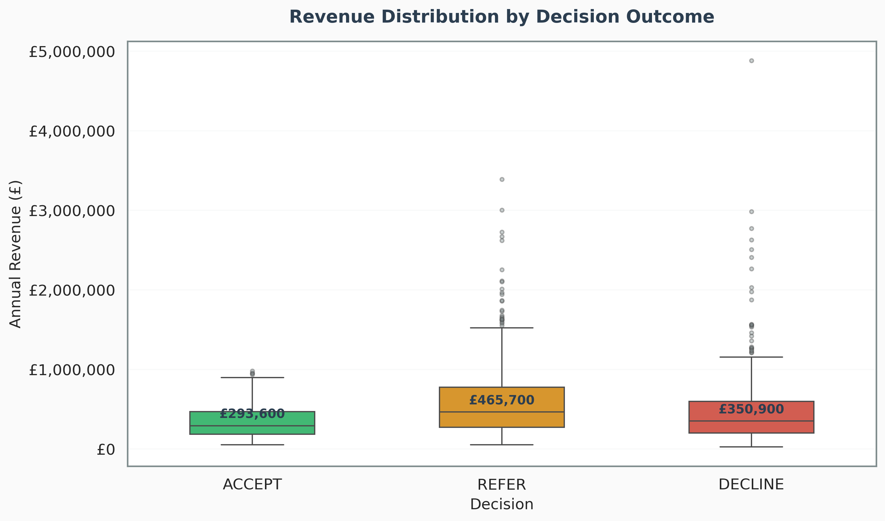
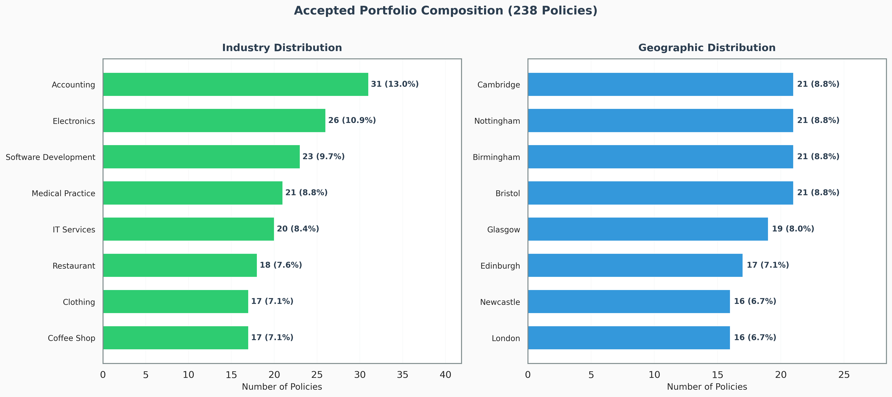
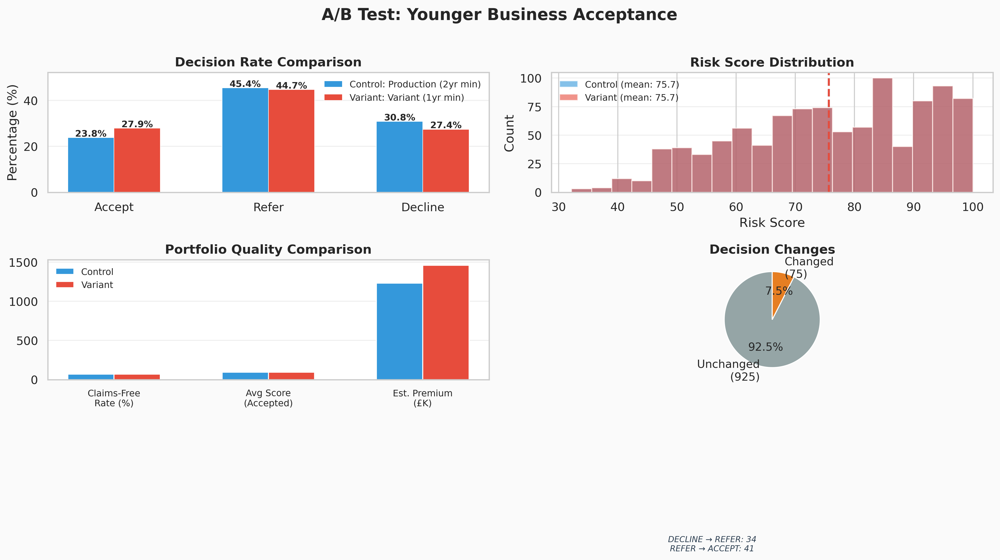

# ⚖️ Automated Underwriting Rules Engine


An end-to-end commercial insurance underwriting decision engine that automates risk assessment for SME applications. Combines rule-based logic, portfolio analytics, and risk appetite frameworks to simulate how insurers evaluate thousands of applications while maintaining consistent decision-making and portfolio quality.



---

## Table of Contents

- [Overview](#overview)
- [Business Context](#business-context)
- [Key Features](#key-features)
- [Project Architecture](#project-architecture)
- [Underwriting Rules](#underwriting-rules)
- [Results & Analytics](#results--analytics)
- [Dashboard Screenshots](#dashboard-screenshots)
- [Technology Stack](#technology-stack)
- [Getting Started](#getting-started)
- [Project Structure](#project-structure)
- [Key Insights](#key-insights)
- [Future Enhancements](#future-enhancements)
- [Author](#author)

---

## Overview

In commercial insurance, underwriters evaluate thousands of applications daily to decide whether to **accept** risk, **refer** for manual review, or **decline**. This project builds an automated decision engine that replicates this workflow, processing 1,000 SME insurance applications through a 6-factor risk assessment framework.

**What makes this unique:**
- ✅ Implements real underwriting concepts (risk appetite, authority limits, concentration management)
- ✅ Demonstrates understanding of commercial insurance workflow beyond pure data analysis
- ✅ Balances automation efficiency with specialist judgment requirements
- ✅ Produces professional analytics dashboards for portfolio monitoring

### Project Goals

1. **Understand underwriting workflow** - Learn how insurers make accept/refer/decline decisions
2. **Implement risk appetite framework** - Translate business strategy into operational rules
3. **Demonstrate portfolio thinking** - Monitor concentration, diversification, and risk quality
4. **Bridge technical skills with insurance domain** - Apply data analytics to underwriting problems

---

## Business Context

### The Underwriting Challenge

Commercial insurers face competing objectives:
- **Growth targets** - Write sufficient premium volume to meet business plans
- **Risk quality** - Only accept risks within appetite to maintain profitable loss ratios
- **Efficiency** - Process applications quickly to remain competitive
- **Expertise allocation** - Focus senior underwriter time on complex, high-value risks

### How Decision Engines Help

Automated underwriting rules engines address these challenges by:

**Straight-Through Processing (STP)**
- Low-risk applications meeting clear criteria are auto-accepted
- Reduces processing time from days to minutes
- Target: 40-50% of applications

**Intelligent Referral**
- Complex or borderline cases escalated to experienced underwriters
- Ensures specialist expertise applied where needed
- Target: 30-40% of applications

**Consistent Decline**
- Applications outside risk appetite automatically rejected
- Enforces discipline and protects portfolio quality
- Target: 10-20% of applications

### Real-World Applications

This approach is used by:
- **Traditional Insurers**: Zurich, AIG, AXA for SME commercial lines
- **InsurTech Companies**: CFC, Corvus, Coalition for cyber & tech E&O
- **MGAs**: Delegated authority platforms with rules governance
- **Reinsurers**: Treaty acceptance and risk selection

---

## Key Features

### 1. **Multi-Factor Risk Assessment**
Six independent rules evaluate each application:
- **Industry Classification** - Risk tier assessment (low/moderate/high)
- **Revenue Thresholds** - Exposure limits and authority levels
- **Claims History** - Loss frequency patterns over 5 years
- **Geographic Risk** - Location-based hazard evaluation
- **Coverage Limits** - Adequacy and proportionality checks
- **Business Maturity** - Startup vs established entity assessment

### 2. **Priority-Based Decision Logic**
```
IF any rule returns DECLINE → DECLINE
ELSE IF any rule returns REFER → REFER
ELSE → ACCEPT
```
Conservative approach ensures no risk slips through inappropriately.

### 3. **Portfolio Analytics Dashboard**
Professional visualizations covering:
- Decision distribution and trends
- Referral reason analysis
- Industry concentration monitoring
- Geographic exposure mapping
- Accepted portfolio composition
- Rule performance metrics

### 4. **Comprehensive Audit Trail**
Every decision logged with:
- Individual rule outcomes
- Primary and secondary referral reasons
- Timestamp and processing metadata
- Supporting data for regulatory compliance

### 5. **Risk Scoring Engine (0-100)**
Numerical risk scores complement binary decisions:
- Weighted composite across all 6 factors
- Risk bands: Excellent / Good / Moderate / Poor / Unacceptable
- Differentiates quality within ACCEPT/REFER/DECLINE groups
- Sub-score transparency shows which factors drive the score

### 6. **A/B Testing Framework**
Compare rule configurations to measure impact:
- 4 pre-built experiments (revenue, claims, age, industry reclassification)
- Side-by-side comparison of acceptance rate, portfolio quality, and premium volume
- Decision migration tracking (how many applications changed outcome)
- Fully configurable for custom experiments

---

## Project Architecture

```
┌─────────────────────────────────────────────────────────────────┐
│                    DATA GENERATION LAYER                         │
│  • 1,000 synthetic SME applications                              │
│  • 20+ industry classifications across 3 risk tiers             │
│  • Realistic business attributes and data quality issues        │
└─────────────────────────────────────────────────────────────────┘
                              ↓
┌─────────────────────────────────────────────────────────────────┐
│                    RULES ENGINE LAYER                            │
│  ┌──────────────┐  ┌──────────────┐  ┌──────────────┐          │
│  │   Industry   │  │   Revenue    │  │    Claims    │          │
│  │     Rules    │  │    Rules     │  │    Rules     │          │
│  └──────────────┘  └──────────────┘  └──────────────┘          │
│  ┌──────────────┐  ┌──────────────┐  ┌──────────────┐          │
│  │   Location   │  │    Limits    │  │  Business    │          │
│  │     Rules    │  │    Rules     │  │   Age Rules  │          │
│  └──────────────┘  └──────────────┘  └──────────────┘          │
└─────────────────────────────────────────────────────────────────┘
                              ↓
┌─────────────────────────────────────────────────────────────────┐
│                    DECISION + SCORING LAYER                      │
│  • Orchestrates rule evaluation (DECLINE > REFER > ACCEPT)     │
│  • Risk scoring engine (0-100 weighted composite)              │
│  • Generates comprehensive audit trail                          │
│  • Risk band classification (Excellent → Unacceptable)         │
└─────────────────────────────────────────────────────────────────┘
                              ↓
┌─────────────────────────────────────────────────────────────────┐
│                    ANALYTICS + A/B TESTING LAYER                 │
│  • Portfolio composition analysis and dashboards               │
│  • A/B testing framework for rule calibration                  │
│  • Decision migration tracking between configurations          │
│  • Automated experiment recommendations                        │
└─────────────────────────────────────────────────────────────────┘
```

---

## Underwriting Rules

### Rule 1: Industry Classification

**Purpose**: Segment businesses by inherent risk profile

| Tier | Risk Level | Examples | Auto-Accept |
|------|-----------|----------|-------------|
| **1** | Low | Retail, Professional Services, Tech | ✅ Eligible |
| **2** | Moderate | Construction, Manufacturing | ⚠️ Refer |
| **3** | High | Crypto, Cannabis, Mining | ❌ Decline |

**Business Rationale**: Different industries have fundamentally different loss patterns. Tier 1 industries have predictable, low-severity claims suitable for automated underwriting. Tier 2 requires specialist assessment. Tier 3 outside appetite.

---

### Rule 2: Revenue Thresholds

**Purpose**: Ensure premium adequacy and manage authority limits

| Revenue Range | Tier 1 | Tier 2 | Rationale |
|--------------|--------|--------|-----------|
| < £50K | ❌ Decline | ❌ Decline | Insufficient premium |
| £50K - £1M | ✅ Accept | ⚠️ Refer | Auto-accept threshold |
| £1M - £5M | ⚠️ Refer | ⚠️ Refer | Exceeds junior authority |
| £5M - £10M | ⚠️ Refer | ⚠️ Refer | Senior approval required |
| > £10M | ❌ Decline | ❌ Decline | Concentration risk |

**Business Rationale**: Small businesses don't generate enough premium to cover underwriting costs. Large risks exceed underwriter authority and require concentration assessment.

---

### Rule 3: Claims History

**Purpose**: Assess loss frequency patterns

| Claims (5yr) | Tier 1 | Tier 2 | Interpretation |
|-------------|--------|--------|----------------|
| 0 | ✅ Accept | ✅ Accept | Clean history - ideal |
| 1 | ✅ Accept | ⚠️ Refer | Acceptable if isolated |
| 2 | ⚠️ Refer | ⚠️ Refer | Pattern emerging |
| 3+ | ❌ Decline | ❌ Decline | Unacceptable frequency |

**Business Rationale**: Past losses best predict future losses. Multiple claims indicate fundamental risk management issues.

---

### Rule 4: Geographic Risk

**Purpose**: Assess location-based hazards

- **Standard Risk**: Major UK cities with modern infrastructure
- **Elevated Risk**: Areas with higher crime, weak emergency services, or regulatory complexity
- **Action**: Elevated locations trigger referral for geographic concentration assessment

---

### Rule 5: Coverage Limits

**Purpose**: Ensure adequacy and detect moral hazard

**Proportionality Checks**:
- Limits < 0.5x revenue → Potential underinsurance → Refer
- Limits 1-5x revenue → Appropriate → Accept
- Limits 10-50x revenue → Disproportionate → Refer
- Limits > 50x revenue → Moral hazard concern → Decline

**Absolute Limits**:
- Liability/Property > £5M → Exceeds authority → Refer

---

### Rule 6: Business Maturity

**Purpose**: Assess operational stability

| Age | Decision | Rationale |
|-----|----------|-----------|
| < 1 year | ❌ Decline | Startup risk - insufficient history |
| 1-2 years | ⚠️ Refer | New venture - requires business plan |
| 2+ years | ✅ Accept | Established - demonstrated viability |

---

## Results & Analytics

### Executive Summary

| Metric | Result | Industry Benchmark |
|--------|--------|-------------------|
| **Total Applications** | 1,000 | - |
| **Accepted** | 238 (23.8%) | 40-50% target |
| **Referred** | 454 (45.4%) | 30-40% target |
| **Declined** | 308 (30.8%) | 10-20% target |
| **Straight-Through Rate** | 23.8% | 40-50% |
| **Average Revenue (Accepted)** | £344,770 | - |
| **Claims-Free Rate** | 69.7% | 70%+ target |
| **Total Exposure** | £82.1M | - |

### Decision Breakdown

**Top 3 Referral Drivers:**
1. **Tier 2 Industry (53.1%)** - 241 applications requiring specialist assessment
2. **Claims Investigation (9.0%)** - 41 applications with 2 claims needing review  
3. **New Business (9.0%)** - 41 startups requiring business plan evaluation

**Top 3 Decline Reasons:**
1. **Prohibited Industry (45.5%)** - 140 Tier 3 applications outside appetite
2. **Adverse Claims History (25.0%)** - 77 applications with 3 claims
3. **Startup Business (14.3%)** - 44 applications with insufficient trading history

### Portfolio Composition (Accepted Risks)

**Industry Distribution:**
- Professional Services - Accounting: 31 policies (13.0%)
- Retail - Electronics: 26 policies (10.9%)
- Technology - Software Development: 23 policies (9.7%)
- Healthcare - Medical Practice: 21 policies (8.8%)
- Technology - IT Services: 20 policies (8.4%)

**Geographic Distribution:**
- Cambridge: 21 policies (8.8%)
- Nottingham: 21 policies (8.8%)
- Birmingham: 21 policies (8.8%)
- Bristol: 21 policies (8.8%)
- Glasgow: 19 policies (8.0%)

---

## Dashboard Screenshots

### Decision Distribution

*Breakdown of accept/refer/decline decisions across 1,000 applications*

### Referral Analysis

*Top reasons driving manual underwriting review*

### Decline Analysis

*Primary causes of application rejection*

### Industry Performance

*Acceptance rates by industry tier classification*

### Revenue Distribution

*Revenue patterns across different decision outcomes*

### Portfolio Composition

*Industry and geographic breakdown of accepted portfolio*

---

## Risk Scoring Engine

Each application receives a composite risk score (0-100) based on weighted sub-factors:

| Factor | Weight | Rationale |
|--------|--------|-----------|
| **Industry Tier** | 25% | Strongest predictor of loss type |
| **Claims History** | 25% | Strongest predictor of loss frequency |
| **Revenue Band** | 15% | Premium adequacy & exposure size |
| **Business Maturity** | 15% | Operational stability indicator |
| **Coverage Ratio** | 10% | Proportionality & moral hazard signal |
| **Geographic Risk** | 10% | Location-based hazard modifier |

### Score Distribution

| Risk Band | Score Range | Count | Percentage |
|-----------|------------|-------|------------|
| **Excellent** | 80-100 | 442 | 44.2% |
| **Good** | 60-79 | 368 | 36.8% |
| **Moderate** | 40-59 | 181 | 18.1% |
| **Poor** | 20-39 | 9 | 0.9% |
| **Unacceptable** | 0-19 | 0 | 0.0% |

**Mean Score**: 75.7 | **Median**: 77.2 | **Std Dev**: 16.1

### Score vs Decision
Risk scores provide granularity within decision categories — two "REFER" applications may score very differently, helping underwriters prioritise their review queue.

---

## A/B Testing Framework

The framework compares rule configurations ("Control" vs "Variant") to measure the impact of proposed rule changes — exactly how real insurers calibrate automated underwriting.

### Experiment Results

**Test 1: Lower Revenue Floor** (£50K → £25K)
| Metric | Control | Variant | Delta |
|--------|---------|---------|-------|
| Accept Rate | 23.8% | 24.1% | +0.3pp |
| Claims-Free Rate | 69.7% | 69.7% | 0.0pp |
| Est. Premium | £1.23M | £1.23M | +£1.9K |

*Verdict*: Minimal impact — few applications fall in the £25K-£50K range.

**Test 2: Relaxed Claims Tolerance** (1 → 2 claims accepted for Tier 1)
| Metric | Control | Variant | Delta |
|--------|---------|---------|-------|
| Accept Rate | 23.8% | 26.8% | +3.0pp |
| Claims-Free Rate | 69.7% | 61.9% | -7.8pp |
| Est. Premium | £1.23M | £1.39M | +£159K |

*Verdict*: ⚠️ +30 policies and +£159K premium, but claims-free rate drops nearly 8pp. Classic volume vs quality trade-off.

**Test 3: Younger Business Acceptance** (2yr → 1yr minimum)
| Metric | Control | Variant | Delta |
|--------|---------|---------|-------|
| Accept Rate | 23.8% | 27.9% | +4.1pp |
| Claims-Free Rate | 69.7% | 70.3% | +0.5pp |
| Est. Premium | £1.23M | £1.46M | +£228K |

*Verdict*: ✅ Best experiment — +41 policies with no quality degradation. Strong candidate for deployment.

**Test 4: Reclassify Electrical Contractors** (Tier 2 → Tier 1)
| Metric | Control | Variant | Delta |
|--------|---------|---------|-------|
| Accept Rate | 23.8% | 25.5% | +1.7pp |
| Claims-Free Rate | 69.7% | 68.2% | -1.5pp |
| Est. Premium | £1.23M | £1.33M | +£103K |

*Verdict*: ✅ Moderate gain with acceptable quality trade-off.

### A/B Test Visualization

*Example A/B comparison showing decision rate shifts, score distribution, and portfolio quality impact*

---

## Technology Stack

**Core Technologies:**
- **Python 3.10+** - Primary programming language
- **Pandas 2.1+** - Data manipulation and analysis
- **NumPy** - Numerical computing
- **Matplotlib & Seaborn** - Data visualization

**Development Tools:**
- **Jupyter Notebook** - Interactive analysis and EDA
- **pytest** - Unit testing framework
- **Git** - Version control

**Optional Extensions:**
- **Power BI** - Interactive dashboard (can be integrated)
- **PostgreSQL** - Production data warehouse (for scale)

---

## Getting Started

### Prerequisites

- Python 3.8 or higher
- pip package manager
- Virtual environment (recommended)

### Installation

```bash
# Clone the repository
git clone https://github.com/bpshinnick1/underwriting-rules-engine.git
cd underwriting-rules-engine

# Create virtual environment
python -m venv venv
source venv/bin/activate  # On Windows: venv\Scripts\activate

# Install dependencies
pip install -r requirements.txt
```

### Quick Start (5 minutes)

```bash
# 1. Generate synthetic applications
cd src
python data_generator.py --num_applications 1000

# 2. Run decision engine
python decision_engine.py

# 3. Score all applications (0-100)
python risk_scorer.py

# 4. Generate analytics dashboard
python dashboard.py

# 5. Run A/B testing experiments
python ab_testing.py

# View results in dashboards/ folder
```

### Detailed Usage

**Step 1: Generate Data**
```bash
python src/data_generator.py --num_applications 1000 --output data/applications.csv
```
Creates 1,000 realistic SME applications with controlled risk distribution.

**Step 2: Process Applications**
```bash
python src/decision_engine.py
```
Evaluates all applications through 6-rule framework, outputs decisions with reasons.

**Step 3: Analyze Results**
```bash
python src/dashboard.py
```
Generates 6 professional charts + executive summary report.

**Step 4: Interactive Exploration**
```bash
jupyter notebook notebooks/exploratory_analysis.ipynb
```
Test individual rules, create custom scenarios, experiment with thresholds.

### Running Tests

```bash
# Run unit tests
pytest tests/test_rules.py -v

# Expected: 77 tests passing
```

---

## Project Structure

```
underwriting-rules-engine/
│
├── README.md                          # This file
├── QUICKSTART.md                      # 10-minute getting started
├── requirements.txt                   # Python dependencies
├── .gitignore                         # Git ignore rules
│
├── data/                              # Data directory
│   ├── applications.csv               # Generated applications
│   ├── decisions.csv                  # Decision outputs
│   └── data_dictionary.md             # Field definitions
│
├── src/                               # Source code
│   ├── data_generator.py              # Synthetic data creation
│   ├── risk_rules.py                  # 6 underwriting rules
│   ├── risk_scorer.py                 # Risk scoring engine (0-100)
│   ├── decision_engine.py             # Decision orchestration
│   ├── ab_testing.py                  # A/B testing framework
│   └── dashboard.py                   # Analytics & visualization
│
├── notebooks/                         # Jupyter notebooks
│   └── exploratory_analysis.ipynb     # Interactive EDA
│
├── dashboards/                        # Generated outputs
│   ├── decision_distribution.png      # Decision pie chart
│   ├── referral_reasons.png           # Referral bar chart
│   ├── decline_reasons.png            # Decline bar chart
│   ├── industry_acceptance.png        # Industry analysis
│   ├── revenue_distribution.png       # Revenue histogram
│   ├── portfolio_composition.png      # Portfolio breakdown
│   └── summary_report.md              # Executive summary
│
├── docs/                              # Documentation
│   ├── implementation_guide.md        # Step-by-step build
│   └── risk_appetite.md               # Underwriting rationale
│
├── screenshots/                       # Project images
│   └── banner.png                     # README hero image
│
└── tests/                             # Unit tests
    └── test_rules.py                  # Rule validation tests
```

---

## Key Insights

### 1. Low Acceptance Rate is Strategic

**The 23.8% straight-through rate appears low, but reflects intentional design:**

- **Tier 2 Industries (53% of referrals)** - Construction and manufacturing require specialist assessment. The engine correctly identifies when human expertise is needed rather than auto-accepting complex risks.

- **Premium Adequacy (1.6% of declines)** - Businesses under £50K don't generate sufficient premium to justify underwriting costs. This demonstrates commercial awareness beyond pure risk assessment.

- **Risk Quality (100% Tier 1 accepted)** - Every auto-accepted application is low-risk. This strict selection ensures portfolio quality, which is the primary goal of underwriting automation.

**Learning**: Efficiency isn't maximizing STP rate - it's ensuring only appropriate risks are auto-accepted while referring everything else for proper assessment.

---

### 2. Industry Drives Decision Complexity

**Tier classification is the single most influential factor:**

- Tier 1 (Retail, Professional Services) → 60-70% acceptance potential
- Tier 2 (Construction, Manufacturing) → <25% acceptance, all require review
- Tier 3 (Crypto, Cannabis) → 0% acceptance, automatic decline

**Business Implication**: Industry expertise is irreplaceable. Automation works for simple risks, but complex industries always need specialist underwriters.

---

### 3. Revenue Thresholds Control Portfolio Shape

**Small businesses create operational challenge:**
- 1.6% of declines are revenue-driven
- Minimum threshold (£50K) eliminates unprofitable applications
- Maximum threshold (£10M) prevents concentration risk from large exposures

**This mirrors real insurer behavior** - SME platforms explicitly target the £100K-£2M revenue sweet spot where premium justifies effort.

---

### 4. Claims History Has Long Memory

**Multi-claim businesses face automatic decline:**
- 3+ claims in 5 years → 119 applications declined (77 with 3 claims, 42 with 4 claims)
- 2 claims → 41 applications referred for investigation
- Pattern-based rejection prevents adverse selection

**Underwriting principle**: Past losses are the best predictor of future losses. Once a pattern emerges, fundamental risk management issues exist.

---

### 5. Portfolio Composition Reflects Rules

**Accepted portfolio shows strong diversification:**
- No single industry >13% of policies
- Geographic spread across 15 cities
- Average revenue £344,770 (SME focus)
- 69.7% claims-free (high quality)

**Real-world application**: Rules automatically enforce portfolio management objectives without manual intervention.

---

## Future Enhancements

### Phase 1: Intelligence Layer
- [x] **Risk Scoring Engine** - Weighted composite scoring (0-100) across all 6 factors ✅
- [ ] **Machine Learning Risk Scoring** - Train predictive model on historical loss data to augment rules
- [ ] **Natural Language Processing** - Extract risk indicators from business descriptions
- [ ] **Anomaly Detection** - Flag unusual applications for enhanced review

### Phase 2: Operational Integration
- [ ] **REST API Development** - Create API endpoints for real-time decision requests
- [ ] **Premium Calculation** - Link decisions to automated pricing engine
- [ ] **Policy Administration** - Connect to downstream binding and issuance systems

### Phase 3: Portfolio Management
- [ ] **Real-Time Exposure Tracking** - Monitor aggregate limits by geography/industry
- [ ] **Catastrophe Modeling** - Integrate cat exposure accumulation alerts
- [ ] **Dynamic Reinsurance** - Adjust appetite based on treaty capacity

### Phase 4: Optimization
- [x] **A/B Testing Framework** - Test rule variations and measure impact on portfolio metrics ✅
- [ ] **Reinforcement Learning** - Optimize thresholds based on historical performance
- [ ] **Multi-Objective Optimization** - Balance growth, profitability, and risk simultaneously

---

## Author

**Connect:**
- 📧 Email: benpshinnick@outlook.com
- 💼 LinkedIn: [linkedin.com/in/ben-shinnick-674969252](https://linkedin.com/in/ben-shinnick-674969252/)
- 💻 GitHub: [github.com/bpshinnick1](https://github.com/bpshinnick1)

---

## License

This project is licensed under the MIT License - see the [LICENSE](LICENSE) file for details.

---

## Acknowledgments

**Underwriting Principles:**
- Risk appetite framework based on industry best practices from traditional insurers (Zurich, AIG, AXA)
- Decision logic inspired by InsurTech automated binding platforms (CFC, Corvus, Coalition)
- Portfolio management concepts from Lloyd's market underwriting guidelines

**Technical Resources:**
- Synthetic data generation methodology adapted from insurance industry simulation techniques
- Visualization approach follows Tableau/Power BI dashboard design principles for executive reporting

**Educational Context:**
This project simulates commercial insurance underwriting for educational and portfolio demonstration purposes. Risk appetite parameters, industry classifications, and thresholds are illustrative and simplified from real-world complexity.

---

## Project Status


**Current Version**: 1.0  
**Last Updated**: February 2026  
**Development Status**: Portfolio project, actively maintained

---

<div align="center">

**Built with analytical rigor and commercial awareness** ⚖️

*Demonstrating that underwriting is about balancing multiple objectives:*  
*risk quality, operational efficiency, growth targets, and capacity constraints*

[⬆ Back to Top](#-automated-underwriting-rules-engine)

</div>
